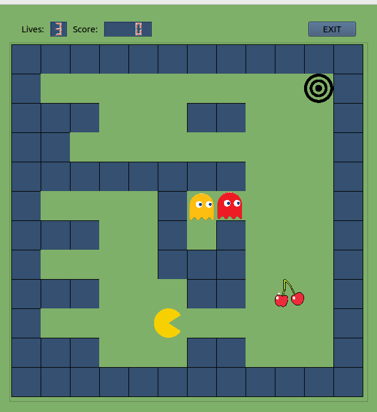

# VUT-FIT-ICP-Pacman
The C++ Programming Language - Pacman project

## Authors
Adam Lazík (xlazik00)
Michal Ľaš (xlasmi00)

## Implemented functionality

- PacMan control using WASD
- Autonomous Ghost movement
- Logging - logs can be found in /logs directory
- Loading of maps from files in /examples/maps/ directory
- Interactive Element: Score
    * with each passed game, player score is incremented by one
    * score resets upon changing the map
- Interactive Element: Lives
    * Player starts with three lives
    * Upon encounter with ghost, player loses one life and the game is reset
    * Upon reaching zero lives, the player is reset
- Interactive Element: Levels
    * Upon completing a level and starting next level, both pacman and ghosts
    are faster

## Unimplemented functionality
- Game replaying
- Pacman movement using mouse

## Game
  

    

